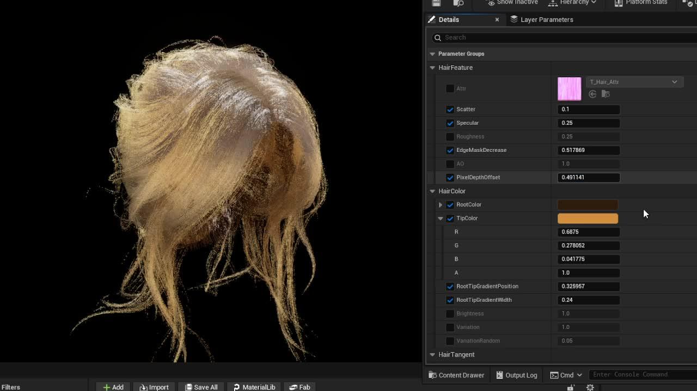

头发渲染有很多种，这一篇主要针对PBR的发丝渲染展开，在制作上主要使用hlsl代码进行书写和优化（尤其是方便优化），也方便在CustomNode中直接调用


```
half3 HairPBR(
FMaterialPixelParameters Parameters,
half2 Coord,
Texture2D AttrTex,
SamplerState AttrTexSampler,
Texture2D DitherNoiseTex,
SamplerState DitherNoiseTexSampler,
float edgeMaksMin,
half3 TangentA,
half3 TangentB,
half3 Tangent,
half PixelDepthOffset,
half RootTipGradientPosition,
half RootTipGradientWidth,
half3 tipColor,
half3 rootColor,
half variation,
half variationRandom,
half brightness,
half AOIntensity,
out half opacityMask,
out half3 tangent,
out half PDO,
out half3 basecolor
)
{
half4 attr = Texture2DSampleLevel(AttrTex, AttrTexSampler, Coord, -1);
half id = attr.g;
half depth = attr.r;
half ao = attr.b;
half opacity = attr.a;
// half noise =  Texture2DSample(DitherNoiseTex, DitherNoiseTexSampler, Coord).r;

half rootTipGradient = RootTipGradient(RootTipGradientPosition,RootTipGradientWidth,Coord);

opacityMask =  OpacityMask(Parameters, depth, opacity, edgeMaksMin);
tangent = HairTangent(id, TangentA, TangentB, Tangent);
PDO = HairPixelDepthOffset(Parameters, depth, DitherNoiseTex, DitherNoiseTexSampler, PixelDepthOffset, rootTipGradient);
basecolor = HairBasecolorRootTip(rootTipGradient, tipColor, rootColor, id, variation, variationRandom, 1, brightness, ao, AOIntensity);

return half3(0,0,0);
}
```

这套 Shader 的核心是一个名为`HairPBR`的主函数，它读取属性纹理（AttrTex）后，将渲染任务拆分成四条独立的输出管线，分别写入OpacityMask，Tangent，PDO，Basecolor，另外Scatter，Specular，Roughness可以传入定值也可以另外纳入计算，这里简化直接用参数传入，为了优化，必要的信息直接合并到纹理中，通道信息如下。


## 一、透明度 & 边缘遮罩：OpacityMask

这里在做Alpha的时候用了一个基于 Fresnel 的遮罩系统，当发丝平面接近正对镜头时数值趋近于 1，侧对镜头（边缘）时数值降低。

```
half OpacityMask(
FMaterialPixelParameters Parameters,
half depth,
half opacity,
float edgeMaskDecrease
)
{

#if SHADING_PATH_MOBILE
half fresnelMaskWithDepth = 1.f;
#else

half fresnel = abs(dot(Parameters.CameraVector, Parameters.WorldNormal)) * 1.5;
half fresnelContrast = CheapContrast(fresnel,1);
half fresnelMaskRemap = lerp( min(-edgeMaskDecrease,0),1,fresnelContrast);
half fresnelMaskWithDepth = lerp(depth * depth, 1, fresnelMaskRemap);
#endif

return opacity * fresnelMaskWithDepth;
}
```

这里CheapContrast使用的算法是

```
half CheapContrast(half input, half contrast)
{
return saturate(lerp(-contrast,1+contrast,input));
}
```

depth² 用来做深度调制，发丝贴图 R 通道的深度值平方后，使发尖区域（depth 小）透明度降低，自然模拟发尖越来越细的视觉效果

edgeMaskDecrease参数控制侧面边缘被剪裁的程度。正值会让 lerp 的起点低于零，将边缘像素 clip 掉，减少描边感。

## 二、HairTangent — 各向异性高光控制

UE 的 Hair Shading Model 基于 Marschner 模型，高光方向由发丝切线向量（Tangent）而非法线决定。这里的`HairTangent`实现了一个多股发丝混合的切线系统。

这里的做法通过 G 通道存储的随机 ID，每根发丝在 TangentA 和 TangentB 两个基础方向之间差值，制造出不同发丝高光方向略有偏移的效果，避免所有发丝同时产生一条亮带。最后叠加外部传入的 Tangent（来自 Mesh 的 UV 切线方向），保证物理朝向正确。

```
half3  HairTangent(
half id,
half3 TangentA,
half3 TangentB,
half3 Tangent

)
{
half3 TangentResult = lerp(TangentA,TangentB,id) + Tangent;
return normalize(TangentResult);
}
```

## 三、BaseColor根梢渐变颜色系统

头发颜色不是均匀的——发根往往更深，发梢可能偏亮或染色。这里用 UV.y 坐标驱动了一套完整的颜色分层系统。

```
half RootTipGradient(half RootTipGradientPosition, half RootTipGradientWidth, half2 Coord)
{
return smoothstep((RootTipGradientPosition - RootTipGradientWidth/2),(RootTipGradientPosition + RootTipGradientWidth/2), Coord.y);
}

half3 HueShift(half3 color, half hueShiftPercentage)
{
// axis = normalize(1,1,1), Period = 1.0 -> angle = percentage * 2PI
half angle = hueShiftPercentage * (2.0h * 3.14159265h);
half3 axis = half3(0.57735027h, 0.57735027h, 0.57735027h); // normalize(1,1,1)

// PivotPoint = 0, so posOffset = color - 0 = color
// UAxis = component of color perpendicular to axis
half3 uAxis = color - axis * dot(axis, color);
// VAxis = cross(axis, uAxis)
half3 vAxis = cross(axis, uAxis);

// Rotate
half cosA = cos(angle);
half sinA = sin(angle);
half3 r = uAxis * cosA + vAxis * sinA;

// RotateAboutAxis returns offset (r - uAxis), add back original color
return color + (r - uAxis);
}

half3 HairBasecolorRootTip(
half rootTipGradiant,
half3 tipColor,
half3 rootColor,
half id,
half variation,
half variationRandom,
half noise,
half brightness,
half ao,
half aoIntensity)
{
half3 rootTipColor = lerp(rootColor, tipColor, rootTipGradiant);

half3 rootTipNoiseColor = rootTipColor * noise + rootTipColor;
rootTipNoiseColor *= brightness;

// variation
rootTipNoiseColor *= lerp(1,lerp(0.5,1.5,id),variation);
rootTipNoiseColor *= HueShift(lerp(half3(1,1,1),half3(1,0,0),variationRandom),id);

half ambient = (1 - ao) * (1 - saturate(aoIntensity)) + ao;

return rootTipNoiseColor * ambient;
}
```

RootTipGradient——可控渐变范围

```
smoothstep(pos - width/2, pos + width/2, UV.y)
```

`RootTipGradientPosition` 控制渐变中心点在发丝上的位置，`Width` 控制过渡带宽度。比线性插值更自然，过渡带边缘不会有突变。

这里比较特殊的是使用了HueShift函数来做颜色随机化，添加写实头发中的杂色。在 RGB 色彩空间中，(1,1,1) 对角线即灰轴，绕灰轴旋转颜色向量就等价于改变色相。这个方法无需任何矩阵，只用 dot/cross/sin/cos，在 GPU 上非常高效，是 UE 材质图中 RotateAboutAxis 节点的手写等价实现。

最后将AO直接叠加到BaseColor中调制暗部细节，并可以通过aoIntensity控制

## 四、Pixel Depth Offset — 制造发丝体积感

发丝 Mesh 通常是简单的面片（Card），但视觉上需要有立体感。PDO 技术通过偏移像素的深度值，让渲染结果假装自己在不同深度，从而欺骗 AO 和阴影系统产生遮挡关系。

```
half AnimatedDither(FMaterialPixelParameters Parameters, Texture2D DitherNoiseTex, SamplerState DitherNoiseTexSampler)
{
// 5 translucency steps, high frequency regular pattern
half2 pixelPos = Parameters.SvPosition.xy;
half2 temperalCoord = pixelPos + View.TemporalAAParams.r;
half temperalCoordSteps = ((uint)(temperalCoord.x) + 2 * (uint)(temperalCoord.y)) % 5;

// random noise to break up the 5 steps
half2 samplerUVs = (pixelPos / half2(64, 64)) + (fmod(View.GameTime, 1.0) * 0.1);
half noise = Texture2DSample(DitherNoiseTex,DitherNoiseTexSampler,samplerUVs).r;

return (noise + temperalCoordSteps)/6;
}

half HairPixelDepthOffset(
FMaterialPixelParameters Parameters,
half depth,
Texture2D DitherNoiseTex,
SamplerState DitherNoiseTexSampler,
half offset,
half rootTipGradient)
{
#if SHADING_PATH_MOBILE
return 0;
#else
half animatedDither = AnimatedDither(Parameters,DitherNoiseTex,DitherNoiseTexSampler).r;
half subtractTipFromDepth = saturate(rootTipGradient - (1 - depth));
return (subtractTipFromDepth + animatedDither - 0.5) * offset;
#endif
}
```

AnimatedDither在这里用时域抖动（TAA 配合的 5 步 pattern + 噪声）平滑深度过渡，同时发根区域深度偏移更大，模拟发根在头皮附近被压住的感觉；发尖偏移小。

---

00:39

---


