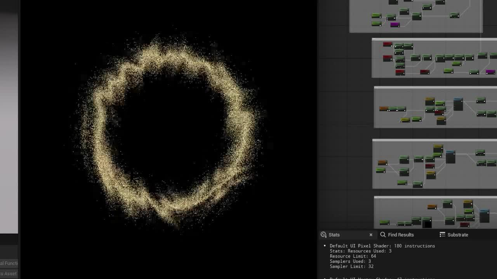
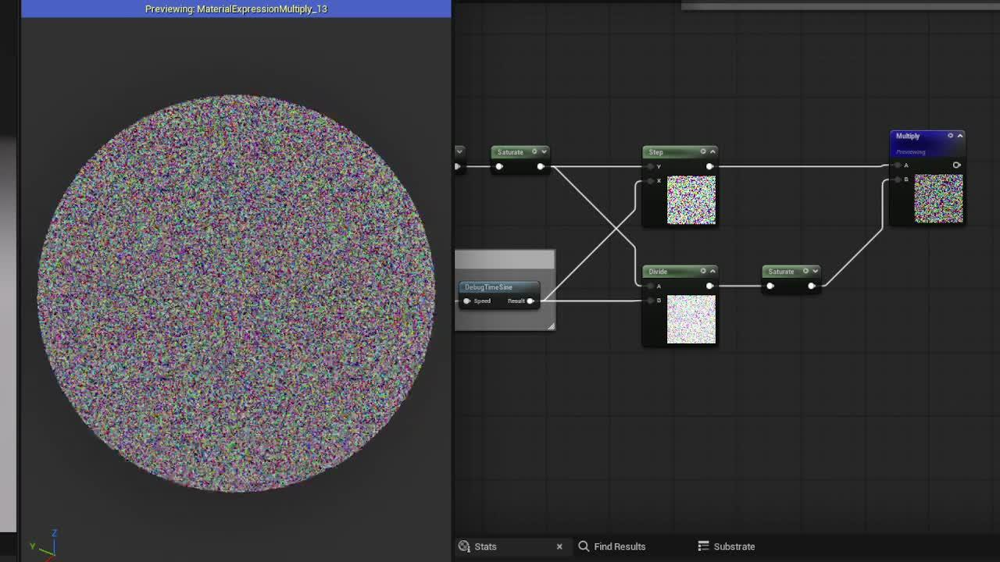
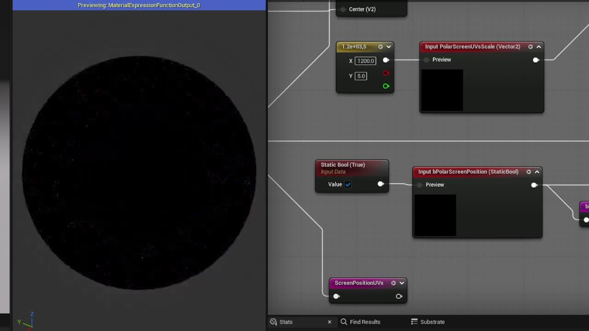
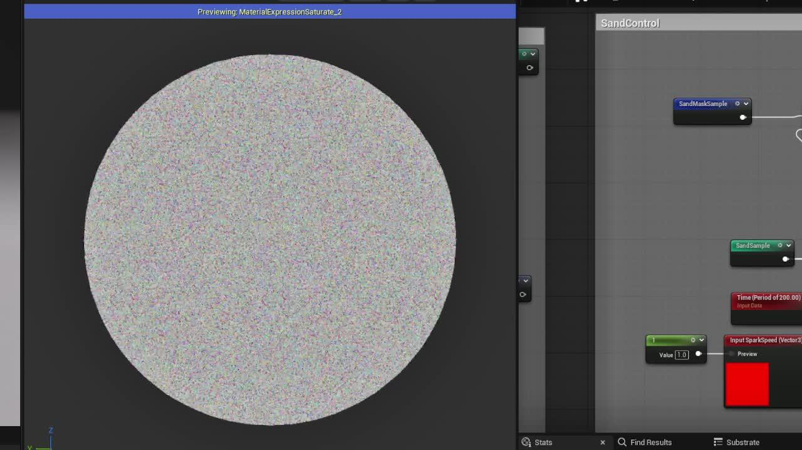
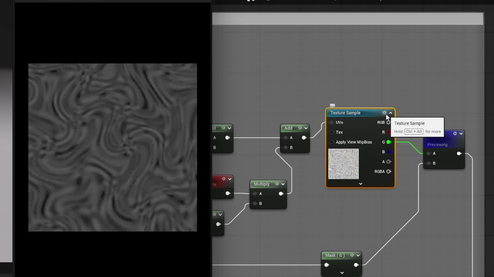

前情提要：这一篇提出了一个问题就是用CurlNoise来模拟沙，同时给出了CurlNoise的算法

[重启RestArt ProjectSH｜Noise-CurlNoise5 赞同 · 0 评论 文章](https://zhuanlan.zhihu.com/p/1931715203692737685)
FlowMap、NoiseUV都是很好的办法，但用通过我的实践发现使用CurlNoise的模拟更具有物理性，其运动也更加自然

00:07

效果并没有太复杂，主要的技术包含两点，一点是CurlNoise，上文已经提及，另一点就是沙的效果

## 一、SandDissolve Function

制作沙溶解效果效果主要就是三个部分——UVs计算、白噪采样模拟、参数控制


其中比较特殊的是用到了白噪声，当白噪声像素和屏幕对齐的时候每一个屏幕像素点就都被赋予了一个独立的随机值，像素在这里也是沙模拟的最小单位

### 基础计算——UV部分


UV这里使用了屏幕空间的像素位置，同时为了对齐像素，结合了贴图的分辨率进行缩放。

同时为了使得我们的UV偏移速度可以在不同分辨率的贴图使用中保持统一，也将分辨率带入了速度的运算

### 基础计算——控制部分


控制部分将输出的采样信息进行了两步操控

橙色部分是控制随机闪烁（Sparking），绿色部分是控制其透明度，也就是模拟沙的浓度

这里用DebugTimeSine节点来做透明度的模拟得到可以动态变化的浓度

这一部分计算我们就得到了对沙完整模拟

00:09

但是这一部分只能满足二维平面运动的模拟，是否可以有纵深扩散的模拟来切换模拟沙的状态呢？就像这样

00:08

### UVs对齐计算


这里我希望首先将2D传入的xy轴UV转为极坐标显示来重构我们的UV

所以我们定义了一个MF_RadialUV函数，用来做极坐标转换

我们将一个标准化的UV传入检查它的效果如下，点离(0，1)的夹角为x轴（需要归一化），从点到圆心的距离是y轴


所以我们可以用这个方式来重构我们的屏幕UV（绿色部分），这里比较特殊的是为了适配所有屏幕的中心我传入了ViewSize/2来获得中心，这样无论对于任何屏幕的渲染都只能出现在屏幕的中心位置，当然你如果需要可以将它传入参数来自我定义

这里也添加了一个开关（橙色部分）来做切换，并且将这个切换reroute，在后面控制部分还会用到

### （拓展）RadialUVs封装为ush函数和材质节点

这里RadialUVs的算法是一定的，我们可以考虑封装

在ush中我单独声明了RadialUVs函数

```
#pragma once

#define PI 3.141592653589793238462643383279502884

float2 RadialUVs(float2 UVs, float2 Center)
{
float2 offset = UVs - Center;  // 相对中心的UV偏移
float2 normalizedOffset = normalize(offset);

// 计算与(0, 1)方向的夹角
float angle = atan2(normalizedOffset.x, normalizedOffset.y);

// 将角度归一化到[0, 1]范围
float angleNormalized = (angle + PI) / (2 * PI);

float offsetDistance = length(offset);

return float2(angleNormalized, offsetDistance);
}
```

这时使用custom直接使用就可以（别忘了include file中的声明和插件对地址的映射），同时也可以尝试将它封装成节点（这是我比较常用的方式）

使用这种节点的方式可以自定义默认值，也可以很好的限制输入和输出，同时还便于在不同的项目和需求中复用

### 白噪声采样计算


这一部分SandSample的算法和上方完全一样，所以在这里不必要太多赘述

不一样的是添加了一层SandMaskSample的采样，其实也是采样的同一张贴图，只是没有做任何移动，这一层是为了在计算纵深运动的时候添加一层蒙版，因为我们UVs计算极坐标会在边缘有一些奇怪的衔接，所以这里需要用Mask蒙版一层（当然还有其他的办法，可以直接上下蒙版UVs的值来计算，不赘述）

### 添加一些控制参数


这里如果未激活极坐标UV，则和我们的基础计算中一样直接操控闪烁和透明度

如果是使用了极坐标UV来进行纵深模拟，那么我们就需要使用蒙版沙这一层来优化我们的效果，同时蒙版沙这一层也做了Sparking的效果（像以前电视机没信号了，那个确实是白噪）

00:04

这样我们就得到了完整的SandDissolve材质函数了，用这个材质函数我们就可以结合CurlNoise来做不同的效果

### （拓展）SandDissolve封装为ush函数和材质节点

首先我们需要在ush中声明两个函数，一个是平面移动，一个是纵深移动

```
#pragma once

#include "/Engine/Private/Common.ush"
#include "Shape.ush"

// sand dissolve simulation on uv planner
float3 SandDissolvePlanner(Texture2D NoiseTexture, SamplerState NoiseSampler,
float2 resolution,
float2 UVs,
float time,
float2 speedMove,
float speedSparking,
float alpha)
{
float2 computedSampleUV = (UVs + floor(time * speedMove * resolution)) / resolution;

float3 noiseColor = Texture2DSample(NoiseTexture, NoiseSampler, computedSampleUV);
float3 noiseSparking = saturate(frac(noiseColor + time * speedSparking));

float3 noiseWithAlpha = step(noiseSparking, alpha) * saturate(noiseSparking / alpha);

return  noiseWithAlpha;
}

// sand dissolve simulation on z direction
float3 SandDissolveZDepth(
Texture2D NoiseTexture,
SamplerState NoiseSampler,
float2 Resolution,
float2 CoordInput,
float time,
float2 speedMove,
float speedSparking,
float alpha,
float2 centerPos,
float2 radialScale)
{
float2 computedUVsInput = RadialUVs(CoordInput,centerPos) * radialScale;
float2 computedSampleUV_Main = (computedUVsInput + floor(time * speedMove * Resolution)) / Resolution;
float3 noiseColor_main = Texture2DSample(NoiseTexture, NoiseSampler, computedSampleUV_Main);

float2 computedSampleUV_Mask = CoordInput / Resolution;
float3 noiseColor_mask = Texture2DSample(NoiseTexture, NoiseSampler, computedSampleUV_Mask);
float3 noiseColor_mask_sparking = saturate(frac(noiseColor_mask + time * speedSparking));

float3 noiseSparkingResult = lerp(noiseColor_mask_sparking * noiseColor_main, noiseColor_main, 0.5f);

float3 noiseWithAlpha = step(noiseSparkingResult, alpha) * saturate(noiseSparkingResult / alpha);

return noiseWithAlpha;
}
```

然后我们在声明的Node中定义一个bool值来决定走哪一条管线（记得定义节点在bool值更改的时候重构，不然参数不会刷新，毕竟纵深移动的函数多两个参数）

**MaterialExpressionSandDissolve.h**

```
#pragma once

#include "CoreMinimal.h"
#include "UObject/ObjectMacros.h"
#include "MaterialExpressionIO.h"
#include "Materials/MaterialExpression.h"
#include "MaterialValueType.h"

#include "MaterialExpressionSandDissolve.generated.h"

UCLASS(MinimalAPI, collapsecategories, hidecategories = Object)
class UMaterialExpressionSandDissolve : public UMaterialExpression
{

GENERATED_BODY()

public:
UPROPERTY(meta =(RequiredInput = "false", ToolTip = ""))
FExpressionInput PannerSpeed;

UPROPERTY(meta =(RequiredInput = "false", ToolTip = ""))
FExpressionInput SparkingSpeed;

UPROPERTY(meta =(RequiredInput = "false", ToolTip = ""))
FExpressionInput Alpha;

UPROPERTY(meta =(RequiredInput = "false", ToolTip = ""))
FExpressionInput CenterPos;

UPROPERTY(meta =(RequiredInput = "false", ToolTip = ""))
FExpressionInput RadialScale;

/** Default scale value if not connected */
UPROPERTY(EditAnywhere, BlueprintReadWrite, Category = MaterialExpressionSandDissolve, meta = (ShowAsInputPin = "Advanced"))
bool bZDepthMove;

UPROPERTY(EditAnywhere, BlueprintReadWrite, Category = MaterialExpressionSandDissolve, meta = (ShowAsInputPin = "Advanced", OverridingInputProperty = "MoveSpeed"))
FVector2D DefaultPannerSpeed;

UPROPERTY(EditAnywhere, BlueprintReadWrite, Category = MaterialExpressionSandDissolve, meta = (ShowAsInputPin = "Advanced", OverridingInputProperty = "SparkingSpeed"))
float DefaultSparkingSpeed;

UPROPERTY(EditAnywhere, BlueprintReadWrite, Category = MaterialExpressionSandDissolve, meta = (ShowAsInputPin = "Advanced", OverridingInputProperty = "Alpha"))
float DefaultAlpha;

UPROPERTY(EditAnywhere, BlueprintReadWrite, Category = MaterialExpressionSandDissolve, meta = (ShowAsInputPin = "Advanced", OverridingInputProperty = "RadialScale"))
FVector2D DefaultRadialScale;

UPROPERTY()
TObjectPtr DefaultWhiteNoise;

UMaterialExpressionSandDissolve(const FObjectInitializer& ObjectInitializer);

//~ Begin UMaterialExpression Interface
#if WITH_EDITOR
// 基础编译方法
virtual int32 Compile(class FMaterialCompiler* Compiler, int32 OutputIndex) override;

virtual void GetCaption(TArray& OutCaptions) const override;
virtual void GetExpressionToolTip(TArray& OutToolTip) override;

virtual FText GetKeywords() const override {return FText::FromString(TEXT("SandDissolve"));}

// 提供输入视图，定义输入
virtual FExpressionInput* GetInput(int32 InputIndex) override;
virtual FName GetInputName(int32 InputIndex) const override;
virtual EMaterialValueType GetInputValueType(int32 InputIndex) override;

// 来响应属性变化
virtual bool CanEditChange(const FProperty* InProperty) const override;
virtual void PostEditChangeProperty(FPropertyChangedEvent& PropertyChangedEvent) override;

// 贴图引用
virtual UObject* GetReferencedTexture() const override;
virtual bool CanReferenceTexture() const override { return true; }

#endif
//~ End UMaterialExpression Interface

};

inline UObject* UMaterialExpressionSandDissolve::GetReferencedTexture() const
{
return DefaultWhiteNoise.Get();
}
```

**MaterialExpressionSandDissolve.cpp**

```
#include "MaterialExpressionSandDissolve.h"

#include "MaterialCompiler.h"
#include "Materials/MaterialExpressionCustom.h"
#include "EasyExtendMathematics.h"
#include "LandscapeRender.h"
#include "Components/DynamicEntryBoxBase.h"

#define LOCTEXT_NAMESPACE "UMaterialExpressionCurlNoise2D"

UMaterialExpressionSandDissolve::UMaterialExpressionSandDissolve(const FObjectInitializer& ObjectInitializer)
:Super(ObjectInitializer),
bZDepthMove(false),
DefaultPannerSpeed(0,-1.f),
DefaultSparkingSpeed(1),
DefaultAlpha(0.25),
DefaultRadialScale(1200,5)
{
// Structure to hold one-time initialization
struct FConstructorStatics
{
// 定义所属分类
FText Category_Display;
FConstructorStatics()
: Category_Display(LOCTEXT("Dissolve", "Dissolve"))
{
}
};

static FConstructorStatics ConstructorStatics;

#if WITH_EDITORONLY_DATA
MenuCategories.Add(ConstructorStatics.Category_Display);
#endif

if (FModuleManager::Get().IsModuleLoaded("EasyExtendMathematics"))
{
FEasyExtendMathematicsModule& Module = FModuleManager::GetModuleChecked("EasyExtendMathematics");
DefaultWhiteNoise = Module.GetWhiteNoiseTexture();
}

}

#if WITH_EDITOR

int32 UMaterialExpressionSandDissolve::Compile(class FMaterialCompiler* Compiler, int32 OutputIndex)
{
if (!DefaultWhiteNoise)
{
return Compiler->Errorf(TEXT("Missing White Noise texture input"));
}

int32 TextureIdx = Compiler->Texture(DefaultWhiteNoise,SAMPLERTYPE_Masks);

int32 ResolutionTextureIdx = Compiler->Constant2(256,256);

int32 PannerSpeedInput = PannerSpeed.GetTracedInput().Expression ?
PannerSpeed.Compile(Compiler) :
Compiler->Constant2(DefaultPannerSpeed.X,DefaultPannerSpeed.Y);

int32 SparkingSpeedInput = SparkingSpeed.GetTracedInput().Expression ?
SparkingSpeed.Compile(Compiler) :
Compiler->Constant(DefaultSparkingSpeed);

int32 AlphaInput = Alpha.GetTracedInput().Expression ?
Alpha.Compile(Compiler) :
Compiler->Constant(DefaultAlpha);

int32 RadialScaleInput = RadialScale.GetTracedInput().Expression ?
RadialScale.Compile(Compiler) :
Compiler->Constant2(DefaultRadialScale.X,DefaultRadialScale.Y);

// 获取 PixelPosition (屏幕空间像素位置)
int32 PixelPositionIdx = Compiler->GetPixelPosition();

// 获取 Time (游戏时间)
int32 GameTimeIdx = Compiler->GameTime(true,200.f);

// 获取 ViewSize (视口尺寸，返回 float2)
int32 ViewSizeIdx = Compiler->ViewProperty(MEVP_ViewSize);
int32 ViewCenterIdx = Compiler->Div(ViewSizeIdx, Compiler->Constant(2.f));
int32 CenterPosInput = bZDepthMove ? (CenterPos.GetTracedInput().Expression ? CenterPos.Compile(Compiler) : ViewCenterIdx ) : ViewCenterIdx;

UMaterialExpressionCustom* MaterialExpressionCustom = NewObject();

MaterialExpressionCustom->Inputs[0].InputName = TEXT("NoiseTexture");
MaterialExpressionCustom->Inputs.Add({ TEXT("resolution") });
MaterialExpressionCustom->Inputs.Add({ TEXT("UVs") });
MaterialExpressionCustom->Inputs.Add({ TEXT("time") });
MaterialExpressionCustom->Inputs.Add({ TEXT("speedMove") });
MaterialExpressionCustom->Inputs.Add({ TEXT("speedSparking") });
MaterialExpressionCustom->Inputs.Add({ TEXT("alpha") });

if (bZDepthMove)
{
MaterialExpressionCustom->Inputs.Add({ TEXT("centerPos") });
MaterialExpressionCustom->Inputs.Add({ TEXT("radialScale") });

MaterialExpressionCustom->Code = TEXT(R"(
return SandDissolveZDepth(
NoiseTexture,
NoiseTextureSampler,
resolution,
UVs,
time,
speedMove,
speedSparking,
alpha,
centerPos,
radialScale);
)");
}
else
{
MaterialExpressionCustom->Code = TEXT(R"(
return SandDissolvePlanner(
NoiseTexture,
NoiseTextureSampler,
resolution,
UVs,
time,
speedMove,
speedSparking,
alpha);
)");
}

MaterialExpressionCustom->OutputType = ECustomMaterialOutputType::CMOT_Float3;

MaterialExpressionCustom->IncludeFilePaths.Add("/EEShaders/Dissolve.ush");

TArray Inputs = bZDepthMove ?
TArray{	TextureIdx,
ResolutionTextureIdx,
PixelPositionIdx,
GameTimeIdx,
PannerSpeedInput,
SparkingSpeedInput,
AlphaInput,
CenterPosInput,
RadialScaleInput}
:	TArray{	TextureIdx,
ResolutionTextureIdx,
PixelPositionIdx,
GameTimeIdx,
PannerSpeedInput,
SparkingSpeedInput,
AlphaInput};

return Compiler->CustomExpression(MaterialExpressionCustom, OutputIndex, Inputs);
}

void UMaterialExpressionSandDissolve::GetCaption(TArray& OutCaptions) const
{
OutCaptions.Add(TEXT("SandDissolve"));
}

void UMaterialExpressionSandDissolve::GetExpressionToolTip(TArray& OutToolTip)
{
OutToolTip.Add(TEXT("Output is a sand dissolve simulation result."));
}

// this define is only used for the following function
FExpressionInput* UMaterialExpressionSandDissolve::GetInput(int32 InputIndex)
{
if (bZDepthMove)
{
switch (InputIndex)
{
case 0: return &PannerSpeed;
case 1: return &SparkingSpeed;
case 2: return &Alpha;
case 3: return &CenterPos;
case 4: return &RadialScale;
default: return nullptr;
}
}
else
{
switch (InputIndex)
{
case 0: return &PannerSpeed;
case 1: return &SparkingSpeed;
case 2: return &Alpha;
default: return nullptr;
}
}

}

FName UMaterialExpressionSandDissolve::GetInputName(int32 InputIndex) const
{
if (bZDepthMove)
{
switch (InputIndex)
{
case 0: return TEXT("PannerSpeed");
case 1: return TEXT("SparkingSpeed");
case 2: return TEXT("Alpha");
case 3: return TEXT("CenterPos");
case 4: return TEXT("RadialScale");
default: return NAME_None;
}
}
else
{
switch (InputIndex)
{
case 0: return TEXT("PannerSpeed");
case 1: return TEXT("SparkingSpeed");
case 2: return TEXT("Alpha");
default: return NAME_None;
}
}
}

EMaterialValueType UMaterialExpressionSandDissolve::GetInputValueType(int32 InputIndex)
{
if (bZDepthMove)
{
switch (InputIndex)
{
case 0: return MCT_Float2;
case 1: return MCT_Float1;
case 2: return MCT_Float1;
case 3: return MCT_Float2;
case 4: return MCT_Float2;
default: return MCT_Unknown;
}
}
else
{
switch (InputIndex)
{
case 0: return MCT_Float2;
case 1: return MCT_Float1;
case 2: return MCT_Float1;
default: return MCT_Unknown;
}
}
}

bool UMaterialExpressionSandDissolve::CanEditChange(const FProperty* InProperty) const
{
return Super::CanEditChange(InProperty);
}

void UMaterialExpressionSandDissolve::PostEditChangeProperty(FPropertyChangedEvent& PropertyChangedEvent)
{
Super::PostEditChangeProperty(PropertyChangedEvent);

// 当 bZDepthMove 属性改变时，刷新节点
if (PropertyChangedEvent.Property &&
PropertyChangedEvent.Property->GetFName() == GET_MEMBER_NAME_CHECKED(UMaterialExpressionSandDissolve, bZDepthMove))
{
// 通知材质编辑器重建节点
if (GraphNode)
{
GraphNode->ReconstructNode();
}
}
}

#endif
```


## 二、CurlNoise-SDF

[重启RestArt ProjectSH｜Noise-CurlNoise5 赞同 · 0 评论 文章](https://zhuanlan.zhihu.com/p/1931715203692737685)


这一部分直接拆解成两个部分来看，一个是采样Noise的时候让它原生采样移动，可以形成一定的流动效果（蓝色部分，这种原生UV偏移肯定会很假，但是作为基础得有）

为了让这个流动更加真实（比FlowMap更加物理）我们就可以加入CurlNoise的计算结果，这里做了一点小的变化，就是让CurlNoise的UV也流动起来，相当于多叠加一层运动使得结果更加物理

在这里加入了一些细节

一方面使用了圆形的大小Radius参与速度运算，因为圆扩散越大它的动势也就越大

另一方方面使用了噪波强度控制了最后的运算结果的强度，因为强度越强，最后Noise的影响就应该越大

00:12

## 三、效果组合与优化


### 距离场计算


UVs这里的计算是确定我们的UV要使用模型原始UV还是屏幕空间的计算UV

然后将UV映射到-1~1后直接画一个比较规整的圆形距离场


在此基础上混合Curl Noise 的结果就能得到稍不规整的Curl Noise Circle


然后通过减去radius来定义环形的内外分区（特别注意这里的黑色并不是0，是有信息的负值，做一个abs就能看到）


### 分层沙扩散模拟计算

接下来就是使用这个SDF结果作为Alpha前置输入，调整后利用SandDissolve节点来计算三层不同沙效果

**中间核心层**


这一层已经能获得主要效果了，同时前面将SDF计算之后的结果做了Reroute，方便后面进行衰减计算时使用

这里最后将G通道和R通道衰减后叠加了起来是为了增加层次感（毕竟计算的也是三个通道的Noise，不能浪费）


**外层效果（使用极坐标运动）**


**内层效果（使用极坐标运动）**


最后将三层使用Max叠加起来然后再加上使用主层计算中的SDFDiffusion这个结果来平方后计算衰减，计算颜色和半透程度，得到最终结果


---


