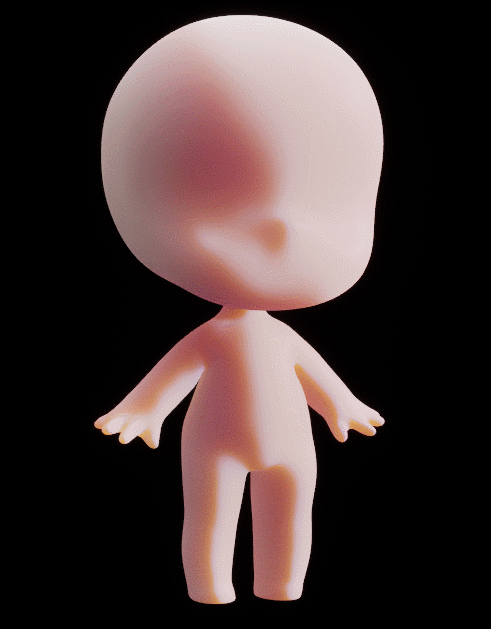

在实时渲染中，次表面散射（Subsurface Scattering）是实现皮肤、玉石等半透明材质真实感的关键技术。目前引擎中主流的实时SSS方案主要分为三类：**基于物理计算的实时散射**、**依赖散射剖面（Subsurface Profile）的预计算方法**、以及**屏幕空间次表面散射（SSSS）**。

其中，屏幕空间SSSS因其性能优势在游戏中广泛应用，但存在显著缺陷：一方面，其可分离卷积（Separable SSS）在静态场景下虽无明显噪点，但在摄像机或物体运动时，由于依赖TAA进行时域抗锯齿，常出现**散射权重与TAA重建失配**导致的闪烁伪影；另一方面，即便在单帧内，基于Burley散射模型的实现也会因**多层高斯核的离散采样**产生颗粒状噪点分布。

这些噪点问题的根源在于屏幕空间方法**无法访问完整的几何信息**，且**每帧独立计算**缺乏时域一致性。为此，我们找到一种更传统的从根本上规避这些问题的方案——**基于预积分的次表面散射**。该方法通过预计算将散射响应烘焙到查找表中，仅需简单的纹理采样即可获得稳定的散射效果。

英伟达早期有一个Faceworks的示例工程，其中向我们展示了基于Curvature和Shadow预积分图的方案。

[https://github.com/NVIDIAGameWorks/FaceWorks.gitgithub.com/NVIDIAGameWorks/FaceWorks.git](https://link.zhihu.com/?target=https%3A//github.com/NVIDIAGameWorks/FaceWorks.git)


FaceWorks的预积分SSS方案通过 **CurvatureLut** 和 **ShadowLut** 将散射分解为多部分，尤其擅长处理鼻尖等曲率突变区域的明暗过渡。在UE中，我们借鉴其 **直接光SSS**、**ShadowSSS** 和 **DeepScatter** 的实现来改造Subsurface Shading Model管线

## 一、改造Subsurface管线

首先我们要保留Subsurface的通道传入，并在UE中打开CustomData0和CustomData1


其次我们要将SSS的颜色传入和颜色显示解绑

1.在DeferredLightingCommon.ush中将DiffuseShadow的计算剔除，因为我们会使用ShadowLut来计算阴影颜色

```
const half DiffuseShadow = (GBuffer.ShadingModelID == SHADINGMODELID_SUBSURFACE) ? 1.0 : Shadow.SurfaceShadow;
LightAccumulator_AddSplit( LightAccumulator, Lighting.Diffuse, Lighting.Specular, Lighting.Diffuse, MaskedLightColor * DiffuseShadow, bNeedsSeparateSubsurfaceLightAccumulation );.SurfaceShadow;
```

2.在BasePassPixelShader.usf中解绑SSS的颜色计算，但保留其作为通到传递数据的作用

```
#if MATERIAL_SHADINGMODEL_SUBSURFACE
else if (ShadingModel == SHADINGMODELID_SUBSURFACE)
{
// FaceWorks SSS: 原始数据写入 GBuffer.CustomData.rgb，供 BxDF 使用
SubsurfaceColor = GetMaterialSubsurfaceDataRaw(PixelMaterialInputs).rgb;
}
#endif
```

3.同时在BasePassPixelShader.usf中屏蔽DiffuseColor对SubsurfaceColor的叠加（这里可以将SHADINGMODELID_PREINTEGRATED_SKIN单独处理）

```
#if MATERIAL_SHADINGMODEL_SUBSURFACE || MATERIAL_SHADINGMODEL_PREINTEGRATED_SKIN
if (GBuffer.ShadingModelID == SHADINGMODELID_SUBSURFACE || GBuffer.ShadingModelID == SHADINGMODELID_PREINTEGRATED_SKIN)
{
// Add subsurface energy to diffuse
//@todo - better subsurface handling for these shading models with skylight and precomputed GI
// FaceWorks SSS: SUBSURFACE 的间接光颜色由 SSS 管线自行处理，暂时屏蔽 SubsurfaceColor 叠加
//DiffuseColorForIndirect += SubsurfaceColor;
}
#endif
```

4.还要在BasePassPixelShader.usf中阻断间接光计算原始的SubsurfaceColor

```
#if MATERIAL_SHADINGMODEL_SUBSURFACE
// FaceWorks SSS: GBuffer 写入完成，清零 SubsurfaceColor，阻断后续间接光计算
if (ShadingModel == SHADINGMODELID_SUBSURFACE)
{
SubsurfaceColor = 0;
}
#endif
```

5.我们在BasePassPixelShader.usf用PrecomputedShadowFactors来记录其传入值

```
#elif MATERIAL_SHADINGMODEL_SUBSURFACE
GBuffer.PrecomputedShadowFactors = float4(GetMaterialCustomData0(PixelMaterialInputs), GetMaterialCustomData1(PixelMaterialInputs), SubsurfaceColor.x,SubsurfaceColor.y);
```

6.同时阻断ShadingModelsMaterial.ush中对SubsurfaceColor传入的值编码处理（这里可以将CustomData先空出来用于后续开发使用）

```
#if MATERIAL_SHADINGMODEL_SUBSURFACE
else if (ShadingModel == SHADINGMODELID_SUBSURFACE)
{
// GBuffer.CustomData.rgb = EncodeSubsurfaceColor(SubsurfaceColor);
// GBuffer.CustomData.a = Opacity;

}
#endif
```

7.在ShadingModels.ush中声明一个新的CustomSubsurfceBxDF来实现新的逻辑

```
FDirectLighting CustomSubsurfaceBxDF(FGBufferData GBuffer, half3 N, half3 V, FAreaLight AreaLight, FShadowTerms Shadow )
```

同时在一开始处理编辑器的输入，并保留DefaultLitBxDF的基础算法

```
FDirectLighting Lighting = DefaultLitBxDF(GBuffer, N, V, AreaLight, Shadow);

// 输入参数
const half  Curvature = GBuffer.PrecomputedShadowFactors.r;
const half  SSSIntensity = GBuffer.PrecomputedShadowFactors.g;
const half3 ScatterColor = Texture2DArraySampleLevel(
View.ToonRenderBRDF, View.ToonRenderBRDFSampler,
float3(0.4, 0.7, 3), 0).rgb * SSSIntensity;
const half  ScatterFalloff = Curvature; // CustomData0：Deep Scatter 衰减系数
```

## 二、直接光SSS实现

```
// -----------------------------------------------------------------------
// Part 1: Direct Light SSS — Curvature LUT (slice 4, Linear RGBA8)
// LUT 存储各通道散射后的 NdotL 绝对值，X=NdotL→[0,1]，Y=曲率→[0,1]
// -----------------------------------------------------------------------
const half NdotL_raw = dot(N,AreaLight.DiffuseL);

float2 curvUV;
curvUV.x = NdotL_raw * 0.5 + 0.5;
curvUV.y = saturate(Curvature * (1.0 / 9.9) + (-0.1 / 9.9));

const half3 sssNdotL = Texture2DArraySampleLevel(
View.CustomRenderBRDF, View.CustomRenderBRDFSampler,
float3(curvUV, 4), 0).rgb;

// Lambert base * SSS NdotL（替代标量 NoL）
float3 SSSDiffuse = Diffuse_Lambert(GBuffer.DiffuseColor) * AreaLight.FalloffColor * AreaLight.Falloff * sssNdotL;
Lighting.Diffuse = lerp(Lighting.Diffuse, SSSDiffuse, SSSIntensity);
```

这里CustomRenderBRDF是在引擎中额外声明的贴图数组

这里的计算将NdotL作为UVs的x轴坐标，将Curvature值作为y轴坐标来采样CurvatureLut，CurvatureLut并不是作为颜色参与计算，而是RGB不同通道的衰减强度变化

## 三、ShadowSSS实现

```
// -----------------------------------------------------------------------
// Part 2: Shadow SSS — Shadow LUT (slice 3, sRGB RGBA8)
// X轴 = SurfaceShadow, Y轴 = NdotL*0.5+0.5
// 输出 RGB shadow 系数，R 衰减最慢（散射最远），B 最快
// DeferredLightingCommon 中 SUBSURFACE 的标量 shadow 已置 1，此处完全接管
// -----------------------------------------------------------------------
float2 shadowUV;
shadowUV.x = saturate(NdotL_raw * 0.5 + 0.5);
shadowUV.y = GBuffer.PrecomputedShadowFactors.b;

const half3 shadowRGB = Texture2DArraySampleLevel(
View.CustomRenderBRDF, View.CustomRenderBRDFSampler,
float3(shadowUV, 3), 0).rgb;

Lighting.Diffuse *= shadowRGB;
```

ShadowSSS的计算相对来说也较简单，直接使用NdotL和传入值（这个值可以是定值也可以是Curvarture值）来定义ShadowLut的y轴采样，控制阴影接缝处的衰减率

## 四、DeepScatter实现

```
// -----------------------------------------------------------------------
// Part 3: Deep Scatter
// 薄层透射
// Shadow.TransmissionThickness：0=极薄（全透），1=极厚（不透）
// -----------------------------------------------------------------------
const half scatter = exp(-Shadow.TransmissionThickness * ScatterFalloff);
Lighting.Transmission = scatter * ScatterColor * AreaLight.FalloffColor * AreaLight.Falloff * (saturate(-NdotL_raw) * 0.5 + 0.5);
```

DeepScatter比较特殊的是需要使用到Lighting.Transmition并通过exp来计算透射面的衰减率

## 五、效果比较


00:16

这里很明显看到Curvature参数可以控制衰减率，ShadowEdge可以控制明暗交界处的次表面强度

---

**效果拓展**

[重启RestArt ProjectSH｜基于预积分的次表面渲染+Profile优化0 赞同 · 0 评论 文章](https://zhuanlan.zhihu.com/p/2041115663838748743)
---


