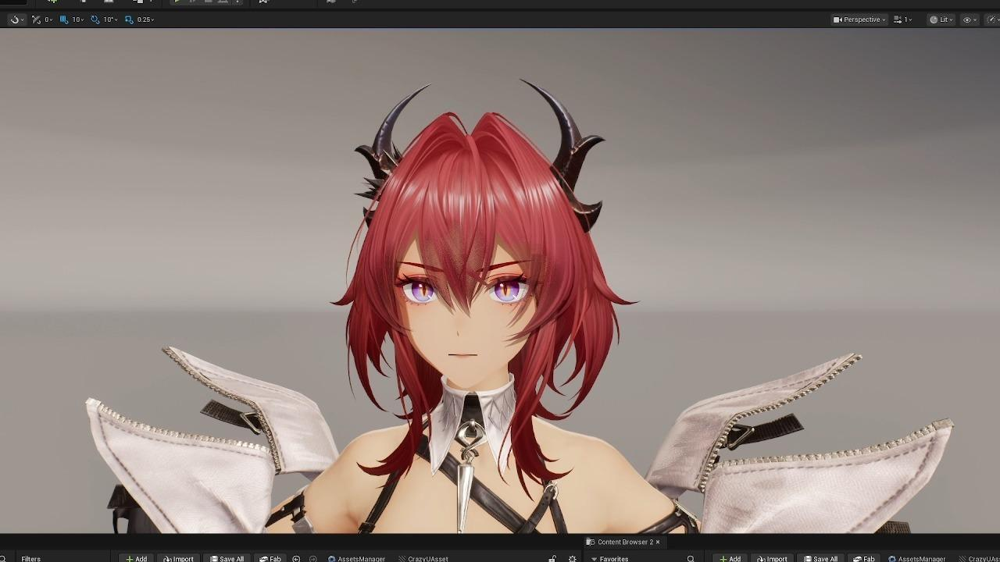

## 一、原实机表现


在终末地中截取了一些角度的高光表现，分析特征我们会发现其基本接近于平直的效果，受到头发模型结构和法线的影响较小，所以高光计算所使用的法线信息是独立于漫反射的

## 二、复原表现

00:08


我们这篇文章主要讨论高光，既然算高光的法线独立于我们的视角我们就需要考虑怎么获得一个比较流畅且平均的法线，这里我使用的是球面法线，球面法线不仅可以预烘焙，也可以使用计算获得，两种方式都比较方便

这里也把计算的方式放在这里参考


红色方框中的是假定了一个圆心，同时我们的计算是基于Preskinned数据，保证即使在模型有运动或者一些变形的时候，我们依然可以获得原始Pose的准确数据

提示：如果要烘焙的话由于头发UV分配的特殊性，可能需要使用到2U

## 三、基于KajiyaKay的高光算法

高光是本文最核心的部分，高光的算法有很多，主要有两种类型，**（各向异性Anisotropic）**和**（各向同性Isotropic）**

在图形渲染领域，这对概念一般用于描述材质表面不同方向对入射光的反射性质

各向同性的材质在各个方向对入射光有着均匀的反射，高光也是呈现规整的圆形或椭圆

各向异性的材质则形成了十分有趣的高光形状，从顶部开始向下弯曲延伸形成了某种锯齿状的环形

这里要渲染头发我们要探讨的是各向异性，而算法也有很多，这里罗列一下一些主要的模型，具体算法我们逐步补充

- 基于高斯分布的**Ward反射模型**
- 传统Phong模型的各向异性扩展**各向异性Phong分布**
- 基于微表面理论的各向异性**Beckmann分布**
- **Kajiya-Kay**非守恒模型
- **Ashikhmin-Shirley模型**
- **Banks毛发模型**
- **Marschner毛发模型**

而我们选择的是算法相对简单一些的Kajiay-Kay模型，Kajiya-Kay 模型是基于经验的，它将头发视为由许多细长的圆柱体组成，每个圆柱体表面的法线方向不是固定的，而是沿着圆柱的切线方向变化。

该模型通过计算切线向量（T）和半角向量（H）的点积来控制高光的形状。同时为了模拟现实中的头发高光，模型中引入了高光偏移的概念，通过副切线（B）沿着法线（N）的偏移来调整高光的位置，从而形成W型或天使环效果（实际应用中可以考虑是否要简化这个环节）


我们可以把Kajiya-Kay用公式表示

dirAtten×(sin⁡θH)specularitydirAtten\times(\sin\theta_H)^{specularity}

sin⁡θH=1−dot(T,H)2\sin\theta_H = \sqrt{1-dot(T,H)^2}

dirAtten=smoothstep(−1,0,dot(T,H))dirAtten = smoothstep(-1,0,dot(T,H))

这样就比较清楚地知道了各向异性的一般计算公式

同时我们可以对 TT 做相应偏移就可以得到更一些高光的随机波动

现在我们转换成代码

```
float3 ShiftTangent (float3 T, float3 N, float shift)
{
float3 shiftedT = T + shift * N;
return normalize (shiftedT);
}

float StrandSpecular(float3 T, float3 V, float L, float exponent)
{
float3 H = normalize(L + V);
float dotTH = dot(T, H);
float sinTH = sqrt(1.0 - dotTH * dotTH);
float dirAtten = smoothstep(-1.0, 0.0, dot(T, H));// fall off

return dirAtten * pow(sinTH, exponent);
}
```

> *GDC 2004 ATI所作关于Hair Shading and Rendering*

### 核心算法


这里值得注意的是我们计算高光的空间也要有选择，世界坐标下的高光反馈和tangent坐标下的高光位置反馈是有一些细微差异的

### Shift信息

Shift信息可以使用一张图来传入即可，我的方法是做了一个函数并添加了菲涅尔项让其更自然


同时我们也可以用另一张图来存储整体偏移值来让错位的高光对齐（如下图就是错位的高光位置，但是是物理正确的），这样的话就不需要球面法线了，但是这种方法相对比较限制，同时会占用一个贴图通道（不过不能否定也是一个好的办法，这里是一个可取的思路）

## 四、利用球面法线参与计算且控制朝向

上面对于我们需要平齐的法线运算其实已经提出了一种通过Shift来解决的方案

那么这里我们可以尝试另外一种方式，就是使用球面法线，球面法线的计算方式上面已经给出了，我们现在就拿球面法线来进行

首先我们直接用SphereNormalWS的计算结果替换VertexNormalWS，会发现已经初见成效，对齐的效果会比之前好了不少


进一步我们改变一下运算的空间，在CameraSpace计算切线，然后将切线转回WorldSpace（下图红色部分）

这样计算出来无论视角如何转动都是一条笔直的直线，也不是很好看

那我们在此基础上使用半程向量的思路，用球面法线进一步引导切线的偏向,这样就会在渲染中出现一个沿着球面法线的弧度，更加自然

normalize(SphereNormalWS+TangentWS)normalize(SphereNormalWS + TangentWS)


### Mask和TRT

这是一个附加的部分

按照头发的模型，其光线分布不止一条高光这么简单，总的来说包括R、TRT、TT等部分，我们为了还原其效果，就要使用两层高光（R和TRT），但是使用不同的specularity的值来进行叠加，相比来说，R更细更集中，TRT更散更泛，但是其基本的算法不变，这里就不重复。

另一个是Mask，这是仿终末地中的一个特殊处理，其主高光层上边缘是平直的渲染状态，所以我们就要单独为其算一下这个边缘并能同步整个的高光参数

所以这里我们要利用没有被Shift处理过的Tangent进行处理


这样我们的主高光层就被裁切掉了


之后就是将两层高光利用自定义shading model进行混合的问题了，超出了咱们这篇文章的讨论范畴

## 五、增强表现的信息贴图

接下来是从终末地中扒下来的一些增强表现的贴图信息

R通道是Filter，遮住了那些不需要体现高光的区域


G通道是发丝的菲涅尔信息，标示了发丝中心和发丝边缘，可以拿来做不一样的变化效果


B通道则存储的AO信息


上述算法依然有待完善，会随着笔者的实践尝试后不断更新，大家根据项目实际需求进行借鉴

---


